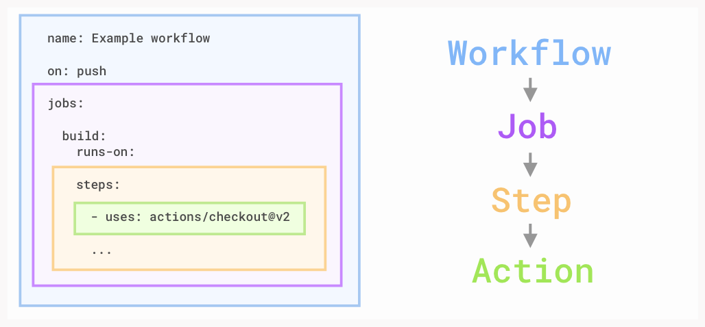

# Continious Integration

**CI** can help you stick to your team’s quality standards by running tests and reporting the results on GitHub. CI tools run builds and tests, triggered by commits. The results post back to GitHub in the pull request. This reduces context switching for developers, and improves consistency for testing. The goal is fewer bugs in production and faster feedback while developing

## Example

```
name: Team awesome's approval workflow
on: pull_request_review
jobs:
  labelWhenApproved:
    runs-on: ubuntu-latest
    steps:
    - name: Label when approved
      uses: pullreminders/label-when-approved-action@master
      env:
        APPROVALS: "1"
        GITHUB_TOKEN: ${{ secrets.GITHUB_TOKEN }}
        ADD_LABEL: "approved"
 ```

The **on:** field is what tells GitHub Actions when to run. In this case, we're running the workflow anytime there's a push.

The **jobs:** block defines the core component of an Actions workflow. Workflows are made of jobs, and our template workflow defines a single job with the identifier build.

Every job also needs a specific host machine on which to run, the **runs-on:** field is how we specify it. The template workflow is running the build job in the latest version of Ubuntu, a Linux-based operating system.


## More Theory





**Workflow:** A workflow is a unit of automation from start to finish, including the definition of what triggers the automation, what environment or other aspects should be taken account during the automation, and what should happen as a result of the trigger.

**Job:** A job is a section of the workflow, and is made up of one or more steps. In this section of our workflow, the template defines the steps that make up the build job.

**Step:** A step represents one effect of the automation. A step could be defined as a GitHub Action, or another unit, like printing something to the console.

**Action:** A GitHub Action is a piece of automation written in a way that is compatible with workflows. Actions can be written by GitHub, by the open source community, or you can write them yourself!

***actions/checkout@v2*** is used to ensure our virtual machine has a copy of our codebase. The checked out code will be used to run tests against.
***actions/setup-node@v1*** is used to set up proper versions of Node.js since we'll be performing testing against multiple versions.

**run:** In addition to running pre-built actions, the workflow can also execute commands, just as you would if you had direct access to the virtual machine. In this portion of the template workflow, we run some common commands relevant to Node.js projects, like npm install to install dependencies and npm test to run the chosen testing framework


We can have a dedicated **test job** so that we can separate out build from test details
```
jobs:
  build:
  .
  .
  
  test:
  .
  .
```

Jobs run in **parallel**, unless configured otherwise.
```
  test:
    needs: build
    runs-on: ubuntu-latest
```

We can test against **multiple targets** so that we know if our supported operating systems and Node.js versions are working.
A **Build matrix** which allow us to test across multiple operating systems, platforms, and language versions.
```
    strategy:
      matrix:
        os: [ubuntu-latest, windows-2016]
        node-version: [12.x, 14.x]
 ```
 
Each job runs in its own virtual environment, so although we've pushed our artifacts to storage, the test job needs to retrieve them.
Access to **build artifacts** so that we can deploy them to a target environment
```
    - uses: actions/download-artifact@main
      with: 
        name: webpack artifacts
        path: public
 ```

**Branch protections** are available so that the main branch can't be deleted or inadvertently broken
This requires **reviews** so that any pull requests are double checked by teammates
Obvious **approvals** so we can merge quickly and potentially automate merges and deployments
```
name: Team awesome's approval workflow
on: pull_request_review
jobs:
  labelWhenApproved:
    run-on: ubuntu-latest
```

**Artifacts** allow you to persist data after a job has completed, and share that data with another job in the same workflow. An artifact is a file or collection of files produced during a workflow run

```
  build:
    runs-on: ubuntu-latest
    steps:
      - uses: actions/checkout@v2
      - name: npm install and build webpack
        run: |
          npm install
          npm run build
      - uses: actions/upload-artifact@main
        with:
          name: webpack artifacts
          path: public/
```


